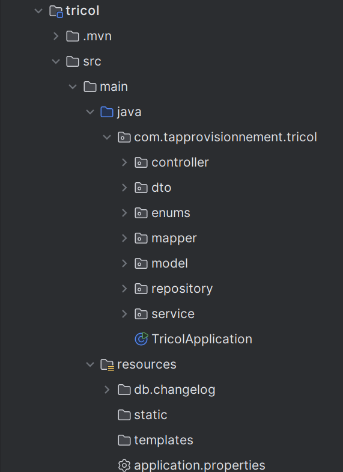

# Projet Tricol - Module Gestion des Commandes Fournisseurs

## 1. Introduction

Ce projet fait partie d’un ensemble qui vise la digitalisation des processus internes de l’entreprise **Tricol**.

Ce module représente **le module de gestion des commandes fournisseurs** ainsi que la **gestion du stock** (mouvements, valorisation et calcul des coûts).

---

## 2. Objectif Fonctionnel du Projet

Développer une **API REST Spring Boot complète** capable de gérer :

- les Fournisseurs
- les Produits
- les Commandes Fournisseurs
- les Mouvements de Stock
- la Valorisation du stock (FIFO / CUMP)

Les APIs doivent permettre :

| Domaine | Actions possibles |
|--------|-------------------|
| Fournisseur | CRUD complet |
| Produit | CRUD complet |
| Commande fournisseur | Création, Mise à jour, Annulation, Validation, Livraison, consultation détaillée |
| Mouvements stock | génération automatique lors de livraison + consultation + filtrage |

---

## 3. Technologies utilisées

| Technologie | Utilisation |
|-------------|-------------|
| Spring Boot | Framework principal backend |
| Spring Data JPA | Accès DB + Repository |
| MapStruct | Mapping DTO -> Entity |
| Liquibase | Migration de DB automatique |
| Swagger / OpenAPI | Documentation API automatique |
| Jakarta Validation | Validation des DTO |

---

## 4. Architecture du Projet

Architecture en couches :

```
controller → service → repository → database
           ↘ mapper ↗
```

- **Controller** : expose les endpoints REST
- **Service** : logique métier / workflow
- **Repository** : accès aux données
- **DTO & Mapper** : communication avec API
- **Liquibase** : versioning des tables

---

## 5. Comment installer et exécuter le projet

### 5.1. Prérequis

| Outil           | Version recommandée |
|-----------------|-----------|
| JDK             | 17 ou + |
| Maven           | 3.9+ |
| IDE             | IntelliJ / Eclipse / VSCode |
| Base de Données | PostgreSQL|

### 5.2. Étapes

#### 1) Cloner le projet

```bash
git clone https://github.com/xxxxx/tricol-gestion-commandes.git
cd tricol
```

#### 2) Configurer application.properties

```properties
spring.datasource.url=jdbc:postgresql://localhost:5432/tricol
spring.datasource.username=postgres
spring.datasource.password=passwor
spring.jpa.hibernate.ddl-auto=none

spring.liquibase.enabled=true
```

> Liquibase va créer automatiquement les tables à l’exécution !

#### 3) Lancer le projet

```bash
mvn spring-boot:run
```

---

## 6. Documentation API

Une fois le projet lancé :

| Outil | URL                                         |
|-------|---------------------------------------------|
| Swagger UI | http://localhost:8080/swagger-ui/index.html |
| OpenAPI JSON | http://localhost:8080/api/                  |

Vous pouvez tester tous les endpoints depuis Swagger.

---

## 7. Pagination & Filtrage

Tous les endpoints GET supportent :

```http
?page=0&size=10
```

---

## 8. Fonctionnement de la gestion du stock

### Lorsqu'une commande passe au statut `LIVREE` :

- des mouvements de type `ENTREE` sont créés automatiquement pour chaque produit
- les quantités en stock sont mises à jour
- le coût du produit est recalculé si méthode **CUMP** activée

Méthode par défaut : `CUMP`


## 9. Diagramme de classe

## 10. Structure du projet



